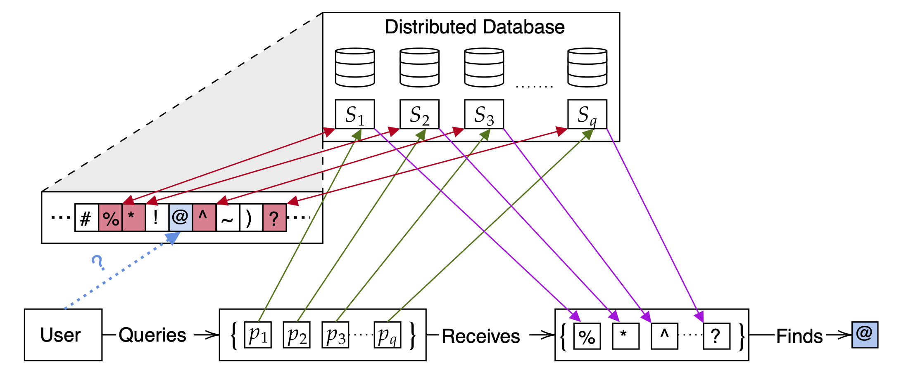

# IT-PIR Schemes

This is an implementation for the IT-PIR schemes based on Reed-Muller and Multiplicity codes, written in SageMath. The code was written in 2021 as part of my Bachelor thesis at Jacobs University Bremen. This is solely intended as a proof-of-concept, and should never be used in any real-life applications.

## Problem Statement

A (Information-Theoretic) Private Information Retrieval (PIR) scheme allows a user to retrieve information from a database that is distributed or replicated across N non-colluding servers, without revealing to any server which information is being accessed. For example, a user might query a specific sequence of characters from a text file, and the servers provide the required data without knowing which characters the user ultimately learned. This process can be visualized as follows:

## Instructions

1. Install the latest version of SageMath

2. run the following command:
   - `sage setup.py --database 16`

3. run some examples:
    - `sage run_example.py --run encode_reed_muller --verbose`
    - `sage run_example.py --run pir_reed_muller --verbose`
    - `sage run_example.py --run encode_multiplicity --verbose`
    - `sage run_example.py --run pir_multiplicity --verbose`
